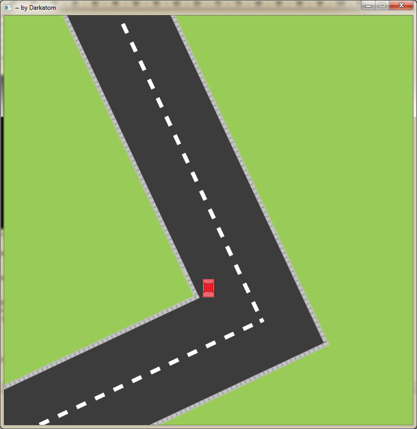

Car and Road
=============
Car and Road game is being programmed with Lua and LÖVE2D 0.8.0 library following the iterative development model.
I'm programming it with the intention of teaching others how to program in Lua and LÖVE2D while having fun with it.

<i>NOTE: The game is still in progress as of now.</i>

Controls
-----------------------------------------------------
WASD: Move the player in the X and Y axis.
Left Arrow - Right Arrow: Turn Left/Right

How to use it
-----------------------------------------------------
Each iteration holds the code for what was developed during that iteration. This means, each one of them holds a copy of the game during various stages.

The only thing you need is [LÖVE2D](http://love2d.org/). Just download the v.0.8.0 and follow the steps.
To execute it, click and drag the root folder of the game to the LÖVE2D.exe icon. If this does not work, check [LÖVE2D webpage](http://love2d.org/) for other methods. 
<i>NOTE: Newer versions might not work properly for this game.</i>

License
-----------------------------------------------------
"Car and Road" is subjected to the LPGL v3 license.
